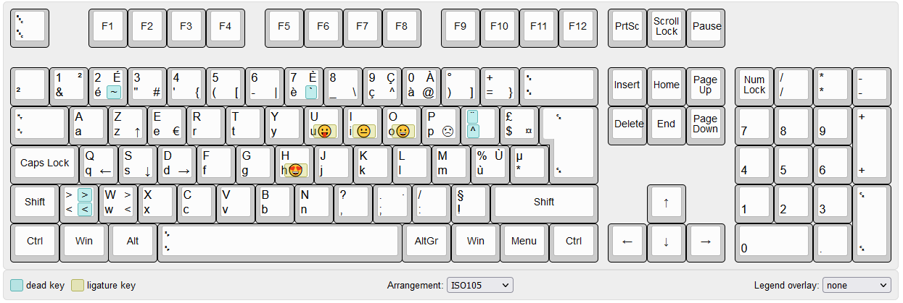

# KBD AZER

## An AZERTY keyboard drivers for Windows with cool features.

Un pilote de clavier, pour Windows (XP à W10 - 32/64 bits) qui permet de faire facilement des majuscules accentuées et d'autres caractères bien sympathiques.

Réalisé avec l'outil [Microsoft Keyboard Layout Creator 1.4 (MSKLC)](https://www.microsoft.com/en-gb/download/details.aspx?id=102134).

## Fonctionnalités

- É : AltGr + Shift + é
- È : AltGr + Shift + è
- À : AltGr + Shift + à
- Ù : AltGr + Shift + ù
et en bonus :
- ↑ ← ↓ → : avec AltGr + Shift + Z, Q, S ou D !
- · (point médian) : AltGr + Shift + ;
- ≤ : AltGr + < puis =
- ≥ : AltGr + Shift puis =
- Quelques smiley avec AltGr + U, I, O, P ou H

L'intégralité des fonctions est visible sur le site [kbdlayout.info](https://kbdlayout.info/a8517097-301d-46af-a54c-9e07427de104).

Cette disposition clavier est compatible avec les claviers 65% ANSI transformés en AZERTY. Vous pouvez alors utiliser les compositions suivantes :
- < avec AltGr + W (pour palier à l'abscence de touche <> sur le clavier ANSI).
- > avec AltGr + Shift + W 

## Téléchargement

## Historique
