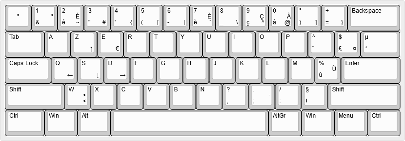

# KBD AZER

## An AZERTY keyboard drivers for Windows with cool features.

Un pilote de clavier, pour Windows (XP à W10 - 32/64 bits) qui permet de faire facilement des majuscules accentuées et d'autres caractères bien sympathiques.

Réalisé avec l'outil [Microsoft Keyboard Layout Creator 1.4 (MSKLC)](https://www.microsoft.com/en-gb/download/details.aspx?id=102134).

## Fonctionnalités

Sur clavier ISO :

Sur clavier ANSI :

Exemple avec la touche "0à@" :

- É : AltGr + Shift + é
- È : AltGr + Shift + è
- À : AltGr + Shift + à
- Ù : AltGr + Shift + ù
et en bonus :
- ↑ ← ↓ → : avec AltGr + Shift + Z, Q, S ou D
- · (point médian) : AltGr + Shift + ;
- ≤ : AltGr + < puis =
- ≥ : AltGr + Shift + < puis =

L'intégralité des fonctions est visible sur le site [http://www.keyboard-layout-editor.com](
http://www.keyboard-layout-editor.com/##@@_a:7%3B&=%C2%B2&_a:4%3B&=1%0A%2F&%0A%0A%0A%0A%0A%0A%C2%B2&=2%0A%C3%A9%0A%0A~%0A%0A%0A%0A%C3%89&=3%0A%22%0A%0A%23&=4%0A'%0A%0A%7B&=5%0A(%0A%0A%5B&=6%0A-%0A%0A%7C&=7%0A%C3%A8%0A%0A%60%0A%0A%0A%0A%C3%88&=8%0A%2F_%0A%0A%5C&=9%0A%C3%A7%0A%0A%5E%0A%0A%0A%0A%C3%87&=0%0A%C3%A0%0A%0A%2F@%0A%0A%0A%0A%C3%80&=%C2%B0%0A)%0A%0A%5D&=+%0A%2F=%0A%0A%7D&_w:2%3B&=Backspace%3B&@_w:1.5%3B&=Tab&=A&=Z%0A%0A%0A%E2%86%91&=E%0A%0A%0A%E2%82%AC&=R&=T&=Y&=U&=I&=O&=P&=%5E%0A%C2%A8&=$%0A%C2%A3%0A%0A%C2%A4&_x:0.25&a:7&w:1.25&h:2&w2:1.5&h2:1&x2:-0.25%3B&=Enter%3B&@_a:4&w:1.75%3B&=Caps%20Lock&=Q%0A%0A%0A%E2%86%90&=S%0A%0A%0A%E2%86%93&=D%0A%0A%0A%E2%86%92&=F&=G&=H&=J&=K&=L&=M&=%25%0A%C3%B9%0A%0A%0A%0A%0A%0A%C3%99&=%C2%B5%0A*%3B&@_w:1.25%3B&=Shift&_t=%23000000%3B&=%3E%0A%3C&=W%0A%0A%0A%3C%0A%0A%0A%0A%3E&=X&=C&=V&=B&=N&=%3F%0A,&=.%0A%2F%3B%0A%0A%0A%0A%0A%0A%C2%B7&=%2F%2F%0A%2F:&=%C2%A7%0A!&_w:2.75%3B&=Shift%3B&@_w:1.5%3B&=Ctrl&_w:1.25%3B&=Win&_w:1.25%3B&=Alt&_a:7&w:6%3B&=&_a:4&w:1.25%3B&=AltGr&_w:1.25%3B&=Win&_w:1.25%3B&=Menu&_w:1.25%3B&=Ctrl).

**Attention** N'utilisez pas les smileys ou les fleches dans un mot de passe, ces caractères UNICODE ne seront probablement pas acceptés.

Cette disposition clavier est compatible avec les claviers 65% ANSI transformés en AZERTY. Vous pouvez alors utiliser les compositions suivantes :
- `<` avec AltGr + W (pour palier à l'abscence de touche <> sur le clavier ANSI).
- `>` avec AltGr + Shift + W 

## Téléchargement

Pour Windows : Derniere version : [Téléchargez le ZIP](https://github.com/psa-jforestier/KbdAZER/releases/tag/v1.3), décompressez le, et lancez le `setup.exe`.

Pour [http://www.keyboard-layout-editor.com](keyboard-layout.json)

## Historique

- [v1.3](https://github.com/psa-jforestier/KbdAZER/releases/tag/v1.3) : Compatible avec les claviers ANSI 65%
- version précédent : non disponible

## Desinstallation

Pour supprimer les anciennes version, aller dans le registre Windows Ordinateur\HKEY_LOCAL_MACHINE\SYSTEM\CurrentControlSet\Control\Keyboard Layouts\